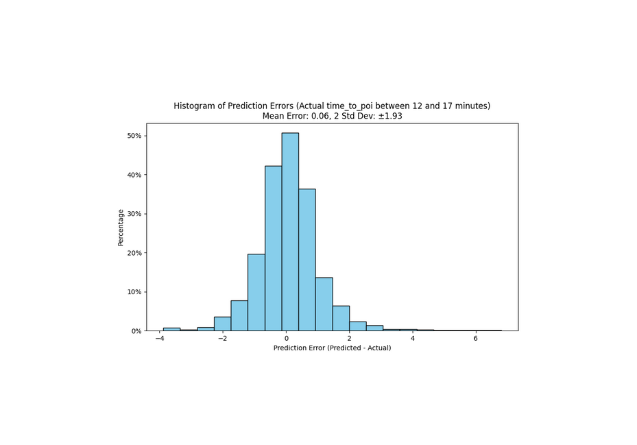
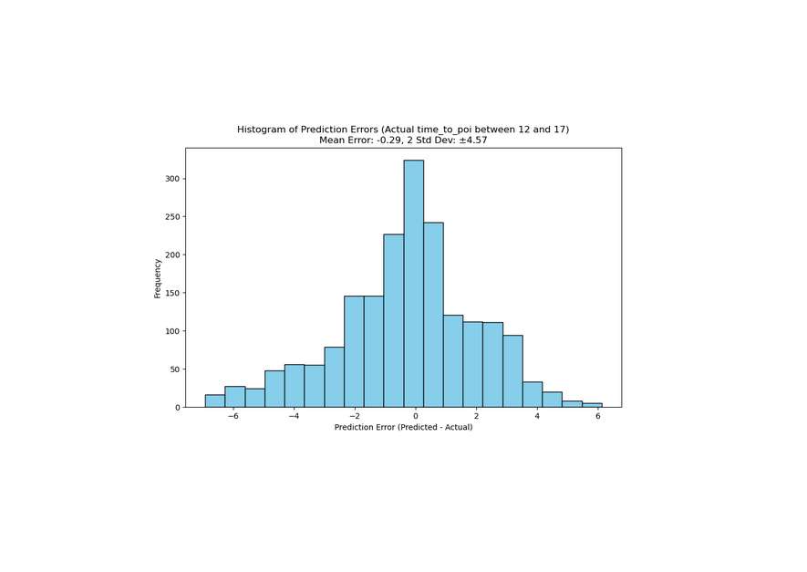
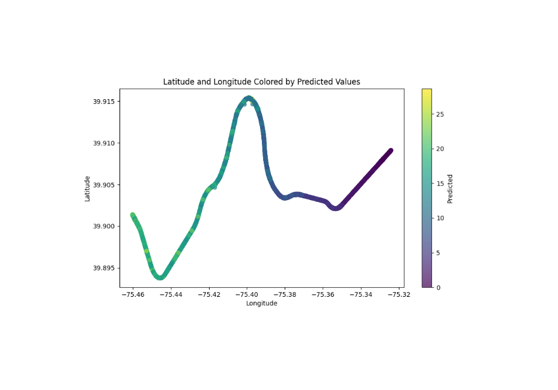
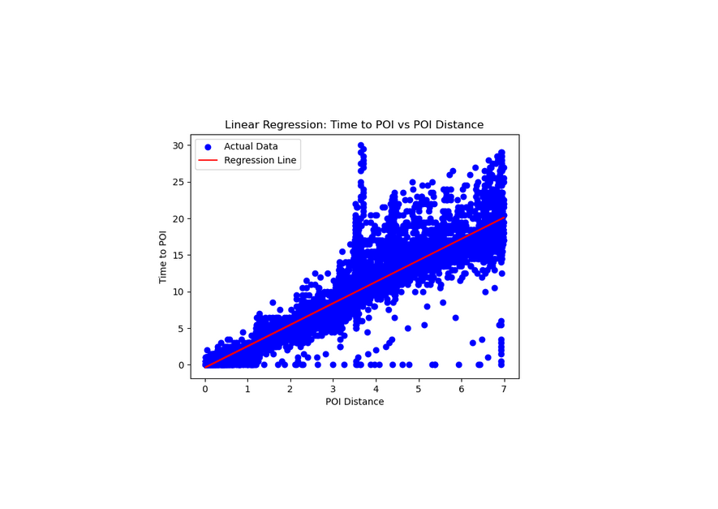
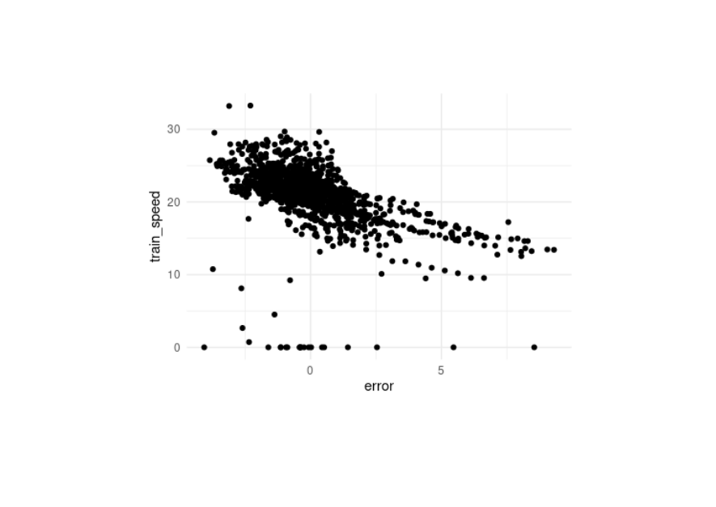

# SEPTA-Tracker
These scripts predict train arrival times at stations for commuter rail of the Southeaster Pennsylvania Transit Authority (SEPTA). The code uses the API and trained machine learning algorithms based on previous month's data logging to estimate the time it takes from a train to arrive at a station of interest.

## Usage

Make sure to have Python 3.x installed. To run the script, use the following steps:

1. Clone the repository:
    ```bash
    git clone https://github.com/andrewdmarques/SEPTA-Tracker.git
    ```

2. Run the scripts (part a, b, and c):
    ```bash
    ./incompleteXXX.py
    ```

Script `a_downloader.py` pulls the PHP data from SEPTA's Regional Rail API: https://www3.septa.org/api/TrainView/index.php

Script `b_grouper.py` reformats and concatinates the individual API pulls into a file "toi.csv" which stands for Train of Interest

Script `c_train-predictor.py` can train the model (if it is to be updated) or can make predictions on already trained models.

`config.csv` contains the information required to specify the "poi" or Point of Interest (which is the latitude and longitude of the train station) in addition to the desired train heading and other parameters. 

## Output

The script generates a CSV file named `next-train.csv` that contains the most recent train prediction data and `predictions.csv` which are a list of all the predictions that have been made.

## Predictions

Predictions were attempeted through several machine learning algorithms before an optimized model was selected. For my applications, the Morton/Rutledge train stations is about a 15 minute walk, therefore, predictions that are 14-17 minutes before the train arrives are most critical for determining when I should leave the house to catch the train while minimizing the amount of time required to wait at the station. 

A decision tree yielded the highest accuracy with the least amount of computer time. 

The image below shows the error (the difference between the predicted and actual time) for trains that would arrive 14-17 minutes. Of the parameter space tested, I estimated that the fewest paremeters with highest accuracy was the current train's distance to station, plus the previous 3 logged distances to station. This resulted in 2 minutes worth of data logging (trains logged every 30 seconds from the SEPTA API).




Previous models were less optimized. Below shows the same conditions with different parameters used for predictions. This might include data such as express vs local train, train and it's last 2 logged position, train speed, train number, etc. 



The predicted results below are shown in the colors below. The x-axis is the longitude and the y-axis is the latitude. 



Alternatives to decision tree alogrithms included neural networks, support vector machines, and linear regression. 
Linear regressions resulted in the some of the least computationally intensive modelling and predictions, however their accuracy was ultimately lower than the decision trees. Below illustrates how linear regression predictions were visualized.



I explored parameters such as train speed to examine their predicitive importance. Below shows the train speed and error from linear regression. 



Parameters such as train number, train source, and train destination (shown below) were included in models but found to have little predictive capacity.


Ultimately, decision trees were implemented because of their high degree of accuracy and relatively little compute requirements.


## Requirements

- incompleteXXX

You can install the required packages using the following command:

```bash
pip install -r requirements.txt incompleteXXX
