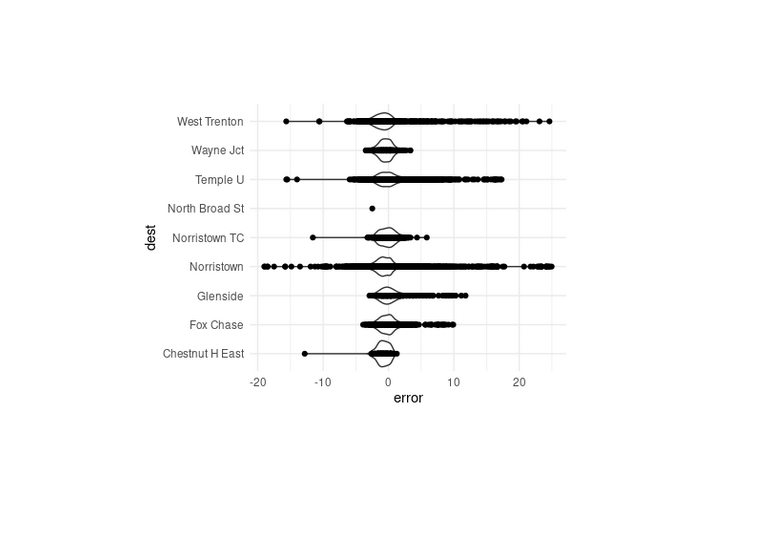

# SEPTA-Tracker
These scripts predict train arrival times at stations for commuter rail of the Southeaster Pennsylvania Transit Authority (SEPTA). The code uses the API and trained machine learning algorithms based on previous month's data logging to estimate the time it takes from a train to arrive at a station of interest.

## Usage

Make sure to have Python 3.x installed. To run the script, use the following steps:

1. Clone the repository:
    ```bash
    git clone https://github.com/andrewdmarques/SEPTA-Tracker.git
    cd train-prediction
    ```

2. Run the script:
    ```bash
    ./incompleteXXX.py
    ```

Make sure the script is executable by using `chmod +x ` if necessary.

## Output

The script generates a CSV file named `next-train.csv` that contains the most recent train prediction data.

## Example Images

Here are some sample images illustrating the output:




## Requirements

- incompleteXXX

You can install the required packages using the following command:

```bash
pip install -r requirements.txt incompleteXXX
